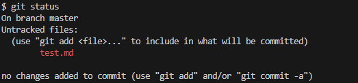

# Работа с Git и GitHub
## 1. Проверка наличия установленного Git
В терминале выполнить команду `git version`.

Если Git установлен, появится сообщение с информацией о версии программы. Иначе будет сообщение об ошибке.
## 2. Установка Git
Загружаем последнюю версию Git с сайта:

[Ссылка на сайт git-scm.com](https://git-scm.com/downloads)

Устанавливаем с настройками по умолчанию.

## 3. Настройка Git
При первом использовании Git необходимо представиться. Для этого нужно выполнить в терминале две команды
```
git config --global user.name "Ваше имя английскими буквами"

git config --global user.email ваша почта@email.com
```
## 4. Инициализация репозитория
Открываем папку.
В терминале перходим к папке, в которой хотим создать репозиторий.

Выполняем команду:
```
git init
```
В исходной папке появится скрытая папка **.git**.
## 5. Добавление файлов под версионный контроль и сохранение
Для добавления файла под версионный контроль необходимо выполнить команду
```
git add <имя_файла> 
```
Указывается имя файла, версии которого необходимо отслеживать (выполняется индексирование файла). Файл должен находиться в папке с созданным ранее репозиторием.

*Для добавления всех файлов можно использовать `git add .` или `git add --all`*

Теперь выполняем commit для фиксирования изменений. Обязательно указываем комментарий.
```
$ git commit -m 'комментарий'
Пример:
$ git commit -m 'Initial commit'
```
*Команда `git commit` берет все данные, добавленные в индекс с помощью git add, и сохраняет их слепок во внутренней базе данных.*

>**Важно**: Git управляет только сохраненными файлами, а не теми, что в процессе редактирования.

## 6. Определение состояния файлов
Для определения состояния файлов необходимо выполнить команду:
```
git status
```

Команда показывает, какие изменения были внесены с помощью команд git add и git commit. Сообщения о состоянии также содержат инструкции по индексированию файлов.

У Git есть три основных состояния, в которых могут находиться файлы: **изменён (modified)**, **индексирован (staged)** и **зафиксирован (committed)**:
* К изменённым относятся файлы, которые поменялись, но ещё не были зафиксированы.
* Индексированный — это изменённый файл в его текущей версии, отмеченный для
включения в следующий коммит.
* Зафиксированный значит, что файл уже сохранён в локальной базе.

Примеры результата выполнения `git status`:


*Это означает, что файл проиндексирован (отслеживается), нет несохраненных изменений.*


*Это означает, что файл проиндексирован, но есть несохраненные изменения. Необходимо выполнить `git commit`.*


*«Changes not staged for commit» означает, что отслеживаемый файл был изменён в рабочем каталоге, но пока не проиндексирован. Чтобы проиндексировать его, необходимо выполнить команду `git add`. Затем `git commit` для сохранения изменений.* 



*Это означает, что нет отслеживаемого файла в папке, необходимо выполнить `git add`.*


## 7. Сохранение новых версий файла
Для сохранения новой версии файла необходимо снова выполнить 
команду:
```
git add <имя_файла> 
```
*Для индексирования всех файлов можно использовать `git add .` или `git add --all`*
Затем для фиксирования изменений:
```
git commit -m "комментарий"
```
Последовательное выполнение `git add <имя_файла>` и `git commit -m 'комментарий'` можно заменить на:
```
git commit -am "комментарий"
или
git commit -a -m "комментарий"
```
>Важно: команда `git commit -am` может быть использована только для фиксирования изменений для уже добавленного ранее к отслеживанию файлу

## 8. Просмотр изменений
Если необходимо узнать, что конкретно изменилось в текущем файле, используется команда: 
```
git diff
```
Результат показывает все изменения сделанные с последнего коммита — только те, что ещё не проиндексированы.
* С отметкой `+` выводятся информация по добавленным строкам.
* С отметкой `-` выводится информация по удаленным строкам.

## 9. Просмотр истории коммитов (фиксированных версий)
Для просмотра истории коммитов необходимо выполнить команду:
```
git log
```
*Результат перечисляет коммиты, сделанные в репозитории в обратном к хронологическому порядке — последние коммиты находятся вверху.*

Для просмотра короткой версии истории коммитов необходимо использовать команду:
```
git log --oneline
```
*Опция `oneline` выводит каждый коммит в одну строку.*


*По умолчанию `git log` отобразит историю коммитов только для
текущей ветки. Для просмотра истории коммитов другой ветки необходимо указать её имя: `git log <имя ветки>`. Чтобы посмотреть историю по всем веткам — выполнить команду с дополнительным флагом: `git log --all`.*


Для просмотра истории с визуализацией необходимо использовать команду:
```
git log --graph
```

>**Важно**: при выводе большого количества строк в режиме лога в конце отображается "`(END)`", новые команды не вводятся. Для выхода из режима лого нужно нажать **`Q`** (Quit).


## 10. Загрузка версий
Для загрузки любой сохраненной версии (например, предыдущего коммита) необходимо выполнить команду:
```
git checkout <номер версии из лога, минимум 4 первых символа>
```
или
```
git switch <номер версии из логи, минимум 4 первых символа>
```
Предварительно необходимо открыть историю изменеий, чтобы указать номер необходимой версии (с помощью `git log`).

Чтобы переключиться обратно на последнюю версию, необходимо ввести:
```
git checkout master
```
*где master - наименование ветки*

С этого момента рабочий файл имеет точно такой же вид, какой был перед возвратом к предыдущей версии.

## 11. Игнорирование файлов
Для того, чтобы исключить из отслеживания в репозитории определённые файлы и папки, нужно создать файл **`.gitignore`** и записать в него названия (или шаблоны), соответствующие таким файлам (или папкам).

К шаблонам в файле `.gitignore` применяются следующие правила:
* Пустые строки, а также строки, начинающиеся с #, игнорируются.
* Стандартные шаблоны являются глобальными и применяются рекурсивно для всего дерева каталогов.
* Чтобы избежать рекурсии используйте символ слеш (/) в начале шаблона.
* Чтобы исключить каталог добавьте слеш (/) в конец шаблона.
* Можно инвертировать шаблон, использовав восклицательный знак (!) в качестве
первого символа.


## 12. Создание веток в Git
По умолчанию имя основной ветки в Git **`master`**.
Создать ветку можно командой:
```
git branch <имя новой ветки>
```
Спсок веток в репозитории можно посмотреть с помощью команды:
```
git branch
```
Текущая ветка будет отмечена  звёздочкой: **\*master**


Для переключения между ветками используется:
```
git checkout <имя ветки>
```
или
```
git switch <имя ветки>
```

Чтобы создать ветку и сразу переключиться на неё, можно выполнить команду `git checkout` с параметром **-b**:
```
git checkout -b <имя новой ветки>
```

## 13. Слияние веток и разрешение конфликтов
Для слияния выбранной ветки с текущей нужно выполнить команду
```
git merge <название ветки>
```

Может возникнуть **конфликт слияния**, если изменили одну и ту же часть файла по-разному в двух объединяемых ветках. В данном случае процесс слияния будет остановлен до тех пор, пока не разрешен конфликт. Git добавляет специальные маркеры конфликтов, чтобы вы могли исправить их вручную. При работе в **Visual Studio Code** автоматически предлагается три варианта разрешения конфликта на выбор:

1. Принять текущую версию
2. Принять новую версию
3. Оставить обе версии

*Также есть вариант **"сравнить"**, который открывает содержимое веток в дополнительном окне для детального сравнения различий, не разрешает возникший конфликт.*

Пример отображения конфликта при слиянии веток:


После слияния веток, необходимо создать новый коммит слияния для фиксирования изменений.

## 14. Удаление веток
Для удаления ветки необходимо выполнить команду:
```
git branch -d <название ветки>
```
**Важно**: если вы находитесь на ветке, которую необхолимо удалить, нужно сначала перейти на другую ветку, а потом выполнить команду удаления.

Ветки, слияние которых не выполнено, могут быть удалены команндой принудительного удаления:
```
git branch -D <название ветки>
```

## 15. Работа с удалёнными репозиториями
Удалённые репозитории представляют собой версии проекта, сохранённые в интернете или ещё где-то в сети (удалённый репозиторий может также находиться на том же
компьютере).
Взаимодействие с другими пользователями предполагает управление
удалёнными репозиториями, а также отправку и получение данных из них.

> Важно: Для работы с удалёнными репозиториями на GitHub должен быть создан аккаунт GitHub.
>
>[Ссылка на сайт github.com](https://github.com/)

### **Добавление удалённых репозиториев**
Для того, чтобы добавить
удалённый репозиторий и присвоить ему имя, выполнить команду:
``` 
git remote add <имя репозитория> <url>:
```

Локальная основная ветка должна быть переименована в `main`. Для этого выполнить команду:
```
git branch -M main
```

Выполнить связывание локальной ветки с удалённой и отправка изменений d удалённый репозиторий:
``` 
git push -u <имя репозитория> main:
```
>при первом выполнении связывания с GitHub необходимо будет авторизоваться через Git

### **Клонирование существующего репозитория**
Для получения копии существующего Git-репозитория нужно выполнить клонирование репозитория. Клонирование репозитория осуществляется командой:
```
git clone <url>
```
При выполнении git clone с сервера забирается (pulled) каждая версия каждого
файла из истории проекта.

### **Просмотр удалённых репозиториев**
Для того, чтобы просмотреть список настроенных удалённых репозиториев, нужно запустить команду:
```
git remote
```
Она выведет названия доступных удалённых репозиториев. Если уже клонирован репозиторий, то будет выведен `origin` — имя по умолчанию, которое Git даёт серверу, с которого производилось клонирование.
Можено также указать ключ `-v`, чтобы просмотреть адреса для чтения и записи, привязанные к репозиторию:
*Пример:*


*Примечание: `git fetch` получает изменеия, `git merge` сливает ветки*

### **Получение изменений из удалённого репозитория**
Чтобы автоматически получить изменения из удалённой ветки и слить их со своей текущей необходимо выполнить команду
```
git pull
```
Выполнение `git pull` извлекает `(fetch)` данные с сервера, с которого изначально клонировали репозиторий, и автоматически пытается слить `(merge)` их с кодом, над которым вы в данный момент работаете. 